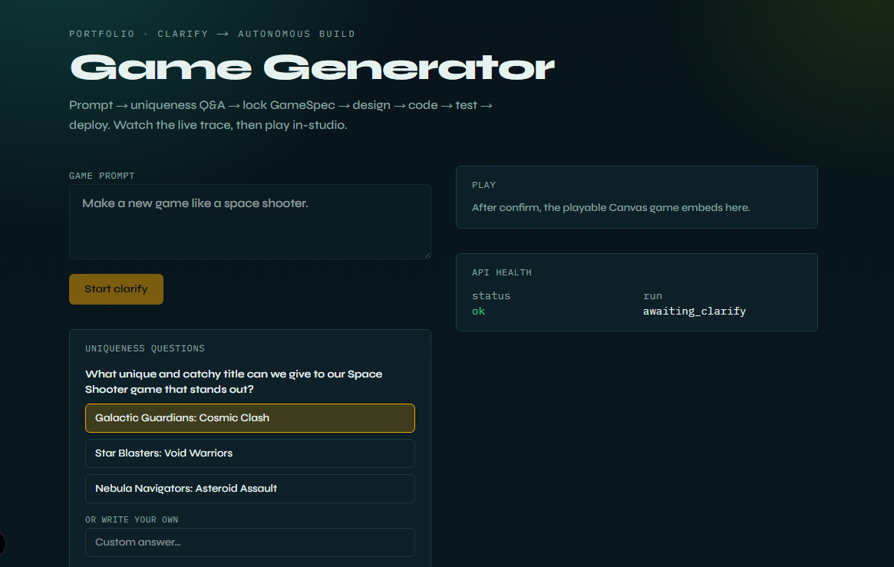
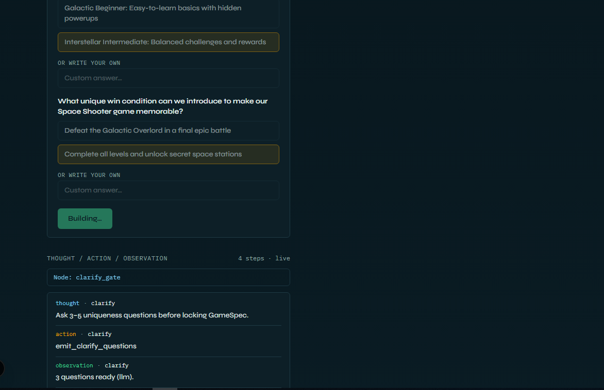
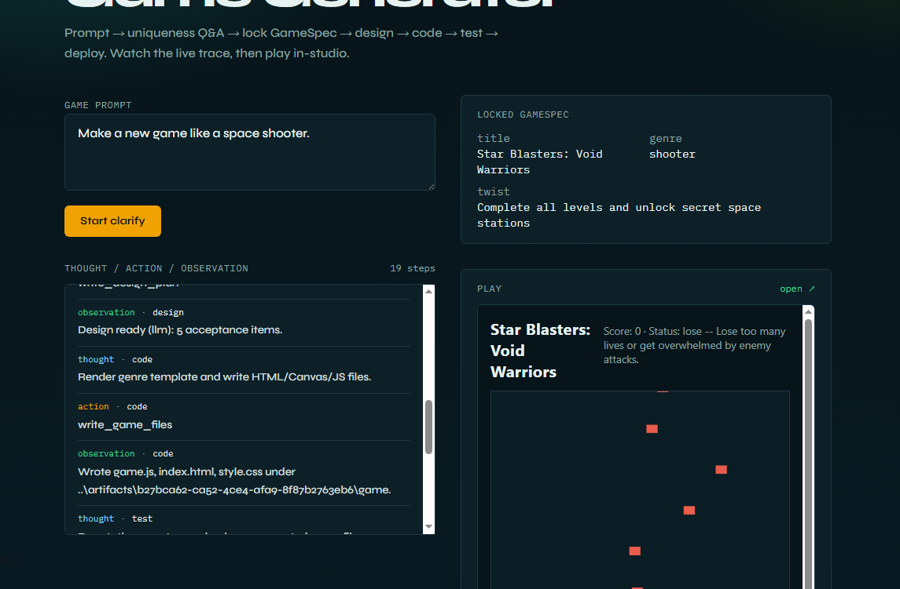
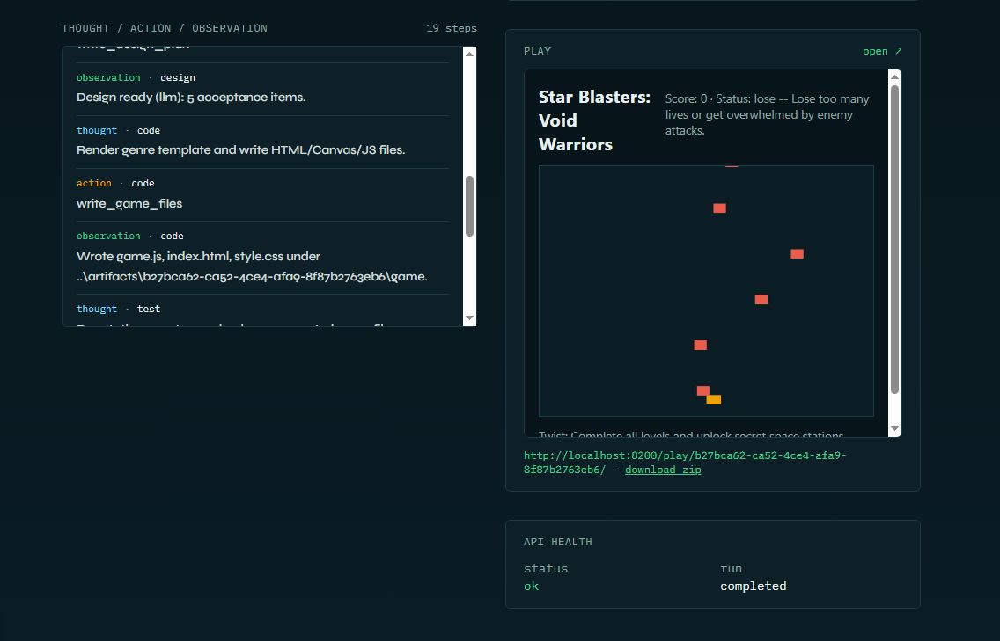
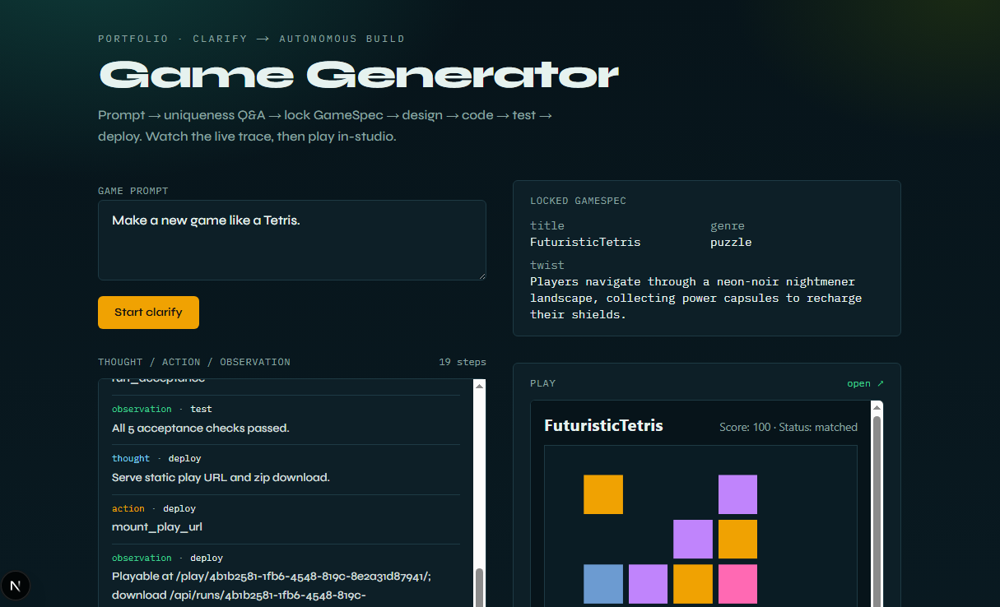

# AI-Game-Generator-Agent

Portfolio sample: a **LangGraph game builder** that turns a natural-language prompt into a **playable HTML/Canvas/JS game**.

| Layer | Role |
| --- | --- |
| **Frontend** | Next.js studio — prompt, clarifying Q&A, live Thought/Action/Observation, play embed |
| **Backend** | FastAPI — runs API, SSE traces, artifact serve (`/play/{id}`) |
| **Agent** | LangGraph pipeline: clarify → lock GameSpec → design → code → test ⇄ repair → deploy |
| **LLM** | Env switch: Ollama / OpenAI / Anthropic / mock |
| **Output** | Static Canvas game + acceptance report under `artifacts/` |

Contrasts with [AI-Procurement-Agent](https://github.com/kondotakuya65/AI-Procurement-Agent): procurement **pauses for HITL** before send; this agent **clarifies once**, then runs **unattended** after GameSpec lock.

**Docs:** [Scenario](docs/01-scenario.md) · [Architecture](docs/02-architecture.md) · [Implementation plan](docs/03-implementation-plan.md) · [Design decisions](docs/04-design-decisions.md) · [Docs index](docs/README.md)

---

## Screenshots

Interactive slider: **[open gallery →](shots/gallery.html)**

| Step | Preview |
| --- | --- |
| 1 · Clarify Q&A |  |
| 2 · Live trace while building |  |
| 3 · Locked GameSpec + play |  |
| 4 · Completed + zip |  |
| 5 · Puzzle genre path |  |

---

## Status

**MVP through E2** — end-to-end studio demo, SSE traces, CI (pytest + Next build). Stretch items (Playwright, gallery) optional.

## Quick start

### Backend

```bash
cd backend
python -m venv .venv
# Windows: .venv\Scripts\activate
pip install -r requirements.txt
copy ..\.env.example .env   # or cp; set LLM_PROVIDER=mock for offline
uvicorn app.main:app --reload --port 8200
```

Health: http://localhost:8200/api/health

### Frontend

```bash
cd frontend
copy .env.local.example .env.local   # or cp
npm install
npm run dev
```

Studio: http://localhost:3002

Root [`.env.example`](.env.example) documents backend knobs (`LLM_PROVIDER`, `CODE_MODE`, `REPAIR_BUDGET`).

## Demo walkthrough (mock, ~2 minutes)

1. Start backend (`:8200`) and studio (`:3002`) with `LLM_PROVIDER=mock` and `CODE_MODE=auto` (or `mock`).
2. Open http://localhost:3002 — confirm **API health** shows `ok`.
3. Keep the demo prompt (*space shooter*) or edit it → **Start clarify**.
4. Answer the uniqueness questions (click a choice or write your own) → **Confirm & lock GameSpec**.
5. Watch the live trace: `lock_spec` → `design` → `code` → `test` → (`repair`) → `deploy`.
6. Play in the embed (or open the FastAPI `/play/{id}/` link). Download zip if you want the static files.

**Expect:** `questions ready (llm)` under mock (fixture JSON), locked GameSpec panel, and a playable Orbit Run–style Canvas game without further clicks.

### Optional: Ollama

Set `LLM_PROVIDER=ollama`, pull a model (`OLLAMA_MODEL`), restart the API. Clarify/lock should prefer `via llm`; if you see `fallback:…` in the trace, the model’s JSON failed validation and the pipeline continued with a repaired/fallback spec.

## Ports

| Service | Port |
| --- | --- |
| Game API | 8200 |
| Game Studio | 3002 |

Chosen to sit beside FinOps (`8000`/`3000`) and Procurement (`8100`/`3001`).

## License

MIT
